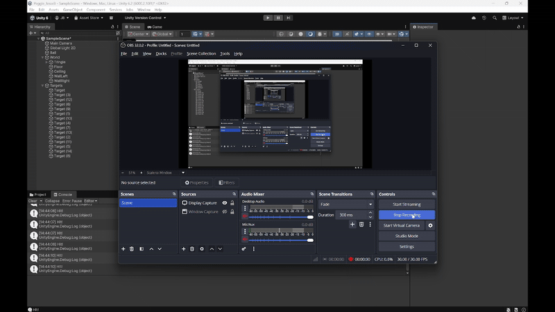

# M2GDV

Titel (werktitel)
Schrijf hier de naam van je spel.

Genre
Physics-based arcade puzzelgame.

Beschrijving
Schrijf in twee of drie zinnen wat de speler doet, wat er geraakt kan worden en hoe er punten worden gescoord.

Gameplaykern
Bal: wat is de bal in jouw thema.
Targets of bumps: wat raakt de bal.
Score: wanneer en hoeveel krijg je punten.
Doel: wat is een geslaagde beurt of level.
Stijl en sfeer
Korte omschrijving van thema, kleuren en geluid.

Structuur van het level
Bovenaan: schietplek.
Midden: veld met targets.
Onderaan: opvang of doelgebied voor het einde van de beurt.

GIF van Les 2.1

